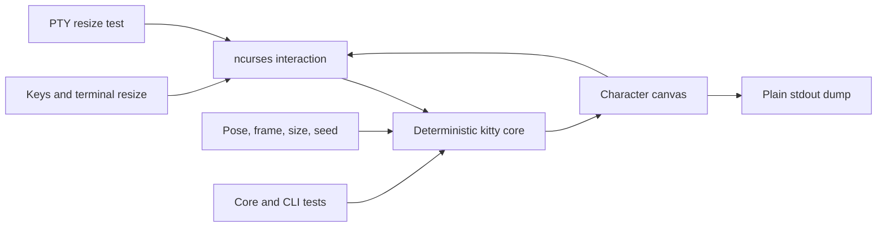

ckitty is a native C11 terminal cat built for delight, but its useful engineering story is separation: the renderer can run without ncurses, interaction, or nondeterministic capture.

<div className="fm-evidence-strip">
  <div className="fm-evidence-cell">
    <span className="fm-proof-label">Status</span>
    <span className="fm-proof-value">Shipped source · macOS and Linux</span>
  </div>
  <div className="fm-evidence-cell">
    <span className="fm-proof-label">Runtime</span>
    <span className="fm-proof-value">C11 · ncurses · libm</span>
  </div>
  <div className="fm-evidence-cell">
    <span className="fm-proof-label">Proof hooks</span>
    <span className="fm-proof-value">Seeded dump mode, core tests, CLI tests, resize tests, sanitizers</span>
  </div>
</div>

## Two paths through one renderer



The interactive path adds input, color, animation, and resize behavior. The dump path asks the same core for one clean frame and writes it to standard output.

## Why `--dump` matters

```bash
./ckitty --dump --seed 123 sit
```

This mode avoids ncurses initialization. It also accepts a frame, width, and height. That makes the project scriptable and gives tests and demo capture a stable surface.

The README animation is generated from real dump frames. `tools/make-demo.sh` records the implementation rather than hand-authoring a more flattering artifact.

## Native boundary

The application builds one `ckitty` binary. The Makefile links ncurses and `libm`, detects Homebrew's keg-only ncurses location on macOS, and lets packagers override compiler and linker flags.

The installer builds and tests that binary, places it under a caller-selected prefix, and never invokes `sudo` itself.

## Verification path

```bash
make
make check
make sanitize
```

`make check` covers the deterministic core, CLI behavior, and pseudo-terminal resize handling. `make sanitize` rebuilds with AddressSanitizer and UndefinedBehaviorSanitizer before running the same checks.

## Honest boundaries

- Building requires a C11 compiler, ncurses headers, and `libm`.
- Sanitizer support depends on the compiler and host platform.
- Dump-mode determinism covers the specified seed and render parameters. Interactive timing still depends on terminal events.
- The project declares GPL-3.0. Distribution packaging should preserve its license notice and source obligations.

## Inspect the evidence

- [Source repository](https://github.com/fortunexbt/ckitty)
- [Renderer core](https://github.com/fortunexbt/ckitty/blob/main/src/ckitty_core.c)
- [Build and verification targets](https://github.com/fortunexbt/ckitty/blob/main/Makefile)
- [CI workflow](https://github.com/fortunexbt/ckitty/actions/workflows/build.yml)
- [Demo capture script](https://github.com/fortunexbt/ckitty/blob/main/tools/make-demo.sh)

<Card title="Prove a kitty repeats" icon="repeat-2" href="/recipes/ckitty-deterministic-frame" horizontal>
  Render the same seeded frame twice, compare it byte for byte, and run the native checks.
</Card>
