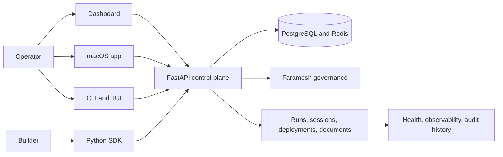

MUTX addresses the part of agent engineering that begins after a prototype works: identity, deployment, sessions, health, authority, cost, review, and reconstruction.

<div className="fm-evidence-strip">
  <div className="fm-evidence-cell">
    <span className="fm-proof-label">Status</span>
    <span className="fm-proof-value">Shipped · source-available</span>
  </div>
  <div className="fm-evidence-cell">
    <span className="fm-proof-label">Public surfaces</span>
    <span className="fm-proof-value">Web, API, macOS, CLI, TUI, Python SDK</span>
  </div>
  <div className="fm-evidence-cell">
    <span className="fm-proof-label">Proof hooks</span>
    <span className="fm-proof-value">Release artifacts, CI, tests, type checks, Playwright</span>
  </div>
</div>

## System shape



The public repository describes a Next.js web surface, FastAPI `/v1/*` contracts, a Click/Textual terminal surface, a first-party Python SDK, and infrastructure for local, cloud, and Kubernetes delivery.

## One control plane, several operators

| Surface | Role |
|---|---|
| `mutx.dev` | Product narrative, releases, and downloads |
| `app.mutx.dev` | Authenticated operator dashboard and browser control surface |
| `src/api/` | Versioned control-plane contracts |
| `cli/` | Command-line and Textual TUI workflows |
| `sdk/mutx/` | Programmatic Python access |
| `infrastructure/` | Docker, Terraform, Ansible, Helm, and monitoring assets |
| `agents/` | Specialist-agent definitions |

The variety is intentional. Human operators, automation, and application code need different interfaces over the same operational state.

## The control boundary

MUTX places governance outside an individual agent loop. Its public materials describe:

- identity and role-based access control;
- OIDC integration for Okta, Auth0, Azure AD, and Keycloak;
- session budgets and phase workflows;
- policy evaluation and runtime tool governance;
- credential brokering and rate controls;
- review gates, observability, and audit history.

This is the **bounded** principle at system scale. The agent does not get to define the limits that govern it.

## Delivery topology

Hosted setup is the documented default. A local stack is also available for operators who want Docker-backed control-plane services on their own machine.

```bash
brew tap mutx-dev/homebrew-tap && brew install mutx
mutx setup hosted
```

For the local topology:

```bash
mutx setup local
mutx doctor
```

The repository also contains Terraform and Ansible for cloud delivery and Helm assets for Kubernetes. Those assets expand the deployment envelope; they do not make every environment identical.

## Verification path

The README publishes a layered validation surface:

```bash
./scripts/test.sh
npm run build
npm run typecheck
npm run test:app
ruff check src/api cli sdk
.venv/bin/python -m pytest
npx playwright test
```

Playwright starts a fresh standalone server by default. That detail matters: a test should fail closed instead of silently passing against a stale local process.

## Honest boundaries

<Warning>
  MUTX is source-available under BUSL-1.1, with code converting to Apache-2.0 after the stated change period. The Python SDK uses Apache-2.0. “Public source” and “permissive open source” are not interchangeable labels.
</Warning>

- This tour explains the published architecture. It is not an independent security assessment.
- Hosted operation introduces service availability and account boundaries that a local stack does not.
- Governance integrations are separate systems with their own trust and version boundaries.
- The public README currently lists v1.4.0 as the latest release; check GitHub for the current release before automating against it.

## Inspect the evidence

- [Source repository](https://github.com/mutx-dev/mutx-dev)
- [Live product](https://mutx.dev)
- [Product documentation](https://docs.mutx.dev)
- [Release history](https://github.com/mutx-dev/mutx-dev/releases)
- [License FAQ](https://github.com/mutx-dev/mutx-dev/blob/main/LICENSE-FAQ.md)

<Card title="Run the operator setup recipe" icon="terminal" href="/recipes/mutx-operator-loop" horizontal>
  Install the CLI, choose a topology, and capture the smallest useful health proof.
</Card>

