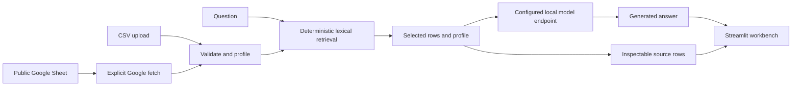

Tablebeam is a small, private-by-default workbench for asking an OpenAI-compatible local model about CSV files and public Google Sheets.

<div className="fm-evidence-strip">
  <div className="fm-evidence-cell">
    <span className="fm-proof-label">Status</span>
    <span className="fm-proof-value">Shipped source · local application</span>
  </div>
  <div className="fm-evidence-cell">
    <span className="fm-proof-label">Data boundary</span>
    <span className="fm-proof-value">CSV stays local; Sheets and selected model endpoint are explicit network paths</span>
  </div>
  <div className="fm-evidence-cell">
    <span className="fm-proof-label">Proof hook</span>
    <span className="fm-proof-value">Retrieved source rows remain visible beside the generated answer</span>
  </div>
</div>

## System shape



The deterministic and generative halves meet at a narrow context boundary. Tablebeam profiles the table and chooses relevant rows without a model. Only that profile, those rows, and the question go to the configured endpoint.

## Components

| Component | Responsibility |
|---|---|
| [`src/data_pipeline.py`](https://github.com/fortunexbt/tablebeam/blob/main/src/data_pipeline.py) | CSV validation, profiling, and deterministic row handling |
| [`src/gsheet_loader.py`](https://github.com/fortunexbt/tablebeam/blob/main/src/gsheet_loader.py) | Explicit public Google Sheets ingestion |
| [`src/assistant_core.py`](https://github.com/fortunexbt/tablebeam/blob/main/src/assistant_core.py) | Retrieval context and model-facing answer flow |
| [`src/provider_control.py`](https://github.com/fortunexbt/tablebeam/blob/main/src/provider_control.py) | LM Studio and Ollama discovery and lifecycle controls |
| [`src/app.py`](https://github.com/fortunexbt/tablebeam/blob/main/src/app.py) | Primary Streamlit interface |
| [`src/api_server.py`](https://github.com/fortunexbt/tablebeam/blob/main/src/api_server.py) | Optional local API with health and readiness endpoints |

## Provider control without surprise installs

LM Studio is the default documented provider. Ollama and other OpenAI-compatible servers can use the same application boundary.

Tablebeam can ask an existing provider process to start, refresh its model list, or load a selected local model. It does not silently install provider software or download model weights.

That distinction supports both **local** and **bounded** operation: the operator chooses when a large or networked action happens.

## Why the source trail matters

An answer includes expandable rows marked with source identifiers. This does not prove that the model's prose is correct. It gives the reader the material needed to check whether the answer is grounded in the retrieved table context.

For exact totals, joins, and complex grouping, the repository recommends a dataframe or SQL workflow. Tablebeam is optimized for quick, inspectable questions rather than pretending that free-form generation replaces exact computation.

## Verification path

```bash
pytest -q
python -m py_compile src/*.py
bash -n start.sh
```

Tests use fake provider responses, so the deterministic pipeline and provider controls can be checked without downloading a model or calling an external API.

## Honest boundaries

- A public Google Sheets URL is fetched from Google. That action is not local.
- The selected model server may have its own logging and retention behavior.
- Source rows expose retrieval context; they do not certify every sentence the model writes.
- The optional API refuses query readiness until `DATA_SOURCE` is configured.
- The Docker image packages the application, not a model or persistent data.

## Inspect the evidence

- [Source repository](https://github.com/fortunexbt/tablebeam)
- [Tests workflow](https://github.com/fortunexbt/tablebeam/actions/workflows/test.yml)
- [Sample dataset](https://github.com/fortunexbt/tablebeam/blob/main/sample_data.csv)
- [Google Sheets guide](https://github.com/fortunexbt/tablebeam/blob/main/docs/guides/google-sheets.md)

<Card title="Trace an answer to its rows" icon="list-tree" href="/recipes/tablebeam-source-trail" horizontal>
  Use the bundled account dataset and inspect the retrieved evidence beside the answer.
</Card>

