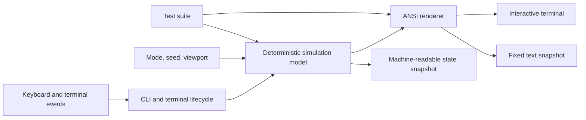

Terminal Starfield turns ANSI output into a 15-wave combat roguelite while keeping the simulation deterministic enough to replay and test.

<div className="fm-evidence-strip">
  <div className="fm-evidence-cell">
    <span className="fm-proof-label">Status</span>
    <span className="fm-proof-value">Shipped · v3.0.0 release</span>
  </div>
  <div className="fm-evidence-cell">
    <span className="fm-proof-label">Runtime</span>
    <span className="fm-proof-value">Python 3.9+ · zero runtime dependencies</span>
  </div>
  <div className="fm-evidence-cell">
    <span className="fm-proof-label">Proof hooks</span>
    <span className="fm-proof-value">Seeds, fixed viewports, text snapshots, machine-readable state</span>
  </div>
</div>

## System shape



The project separates simulation from rendering and raw terminal I/O. That separation is the reason a real-time game can also emit stable frames and state for automation.

## Three operating modes

- **Campaign** has 15 escalating waves, upgrade drafts, and three bosses.
- **Endless** removes the campaign cap and keeps scaling sectors.
- **Zen Drift** preserves the original HUD-free starfield experience.

The same model supports combat, deterministic capture, and compatibility modes. The interface can fall back to ASCII and no color without changing the underlying run rules.

## Model and renderer

| Layer | Public path | Concern |
|---|---|---|
| Entry point | [`starfield.py`](https://github.com/fortunexbt/terminal-starfield/blob/main/starfield.py) | Checkout-friendly launch path |
| CLI and terminal lifecycle | [`terminal_starfield/cli.py`](https://github.com/fortunexbt/terminal-starfield/blob/main/terminal_starfield/cli.py) | Modes, input, signals, TTY restoration |
| Simulation | [`terminal_starfield/model.py`](https://github.com/fortunexbt/terminal-starfield/blob/main/terminal_starfield/model.py) | Ships, enemies, weapons, waves, upgrades, seeded state |
| Rendering | [`terminal_starfield/render.py`](https://github.com/fortunexbt/terminal-starfield/blob/main/terminal_starfield/render.py) | Projection, ANSI frames, HUD, radar, exact sizing |

Keeping model state out of the renderer makes a daily seed, regression fixture, or replay receipt possible without screen scraping.

## Verification path

```bash
python3 -m unittest discover -s tests -v
python3 starfield.py --snapshot 80x24 --seed 42 --no-color --ascii
python3 starfield.py --state-snapshot --seed 42
```

The public test suite covers the full campaign, bosses, menus, weapons, pickups, scoring, upgrades, terminal dimensions, and ANSI output. CI runs on Linux and macOS across the documented Python range.

## Terminal safety is part of the product

Interactive terminal programs own cursor visibility, wrapping, raw input, resize events, alternate screens, and signal cleanup. Starfield documents restoration on resize, `SIGTERM`, and normal exit. The terminal should remain usable after the universe stops.

## Honest boundaries

- The game targets a modern macOS or Linux terminal; Windows uses Windows Terminal through WSL.
- “Zero dependencies” means zero Python runtime dependencies. Python and a capable terminal still define the platform boundary.
- A deterministic seed stabilizes simulation inputs. Timing and interactive human input can still change a live run.
- Snapshot modes prove output shape and state. They are not a performance benchmark.

## Inspect the evidence

- [Source repository](https://github.com/fortunexbt/terminal-starfield)
- [v3.0.0 release](https://github.com/fortunexbt/terminal-starfield/releases/tag/v3.0.0)
- [Test workflow](https://github.com/fortunexbt/terminal-starfield/actions/workflows/test.yml)
- [Test suite](https://github.com/fortunexbt/terminal-starfield/blob/main/tests/test_starfield.py)

<Card title="Replay a seeded universe" icon="binary" href="/recipes/starfield-seeded-run" horizontal>
  Produce two identical text frames and inspect the corresponding state snapshot.
</Card>

