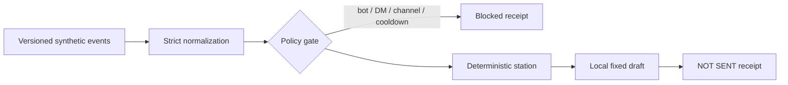

Ambient Relay v1.0.0 is an offline-first Discord automation lab. Its default command replays four versioned synthetic events through strict normalization, policy, deterministic local stations, and body-free receipts. It does not contact Discord or send a message.

<div className="fm-evidence-strip fm-lab-warning">
  <div className="fm-evidence-cell">
    <span className="fm-proof-label">Status</span>
    <span className="fm-proof-value">Released offline proof · v1.0.0</span>
  </div>
  <div className="fm-evidence-cell">
    <span className="fm-proof-label">Verified center</span>
    <span className="fm-proof-value">14 tests, deterministic terminal artifact, zero audit findings, SHA-pinned CI</span>
  </div>
  <div className="fm-evidence-cell">
    <span className="fm-proof-label">Critical boundary</span>
    <span className="fm-proof-value">Live Discord observe/send adapter exists but has not been tested against an account</span>
  </div>
</div>

## The default proof



The fixture covers a routed technical question, a blocked bot author, a routed acknowledgement, and a quiet observation. Builder, Care, and Guide use fixed local templates; no model or provider is involved. Ties resolve in a fixed order, and user content is never interpolated into a reply.

Every decision emits receipt metadata and fingerprints without persisting the event or draft body. The checked-in terminal transcript is regenerated in memory during CI, and drift fails the build.

## Reproduce it

The replay uses only Node's standard library:

```bash
git clone https://github.com/fortunexbt/ambient-relay.git
cd ambient-relay
npm start
```

To run the complete verification, including the isolated optional adapter dependency:

```bash
npm ci --ignore-scripts
npm run check
npm audit --audit-level=high
```

The release cut a network-first 17K-line prototype and a 14-vulnerability dependency graph down to 14 focused tests and 26 locked packages with zero reported audit findings at review time.

## The live gate

Live mode is separate and deliberately inconvenient. It requires an explicit `discord-observe` or `discord-send` mode, exact guild and channel IDs, and a process-environment token. Send mode additionally requires the literal acknowledgement `I_ACCEPT_ONE_CHANNEL_SENDS`.

The adapter ignores non-allowlisted guilds and channels before routing, blocks bots and DMs, disables allowed-mention expansion, and logs selected receipt fields instead of message bodies.

These controls reduce accidental authority. They do not constitute a verified production integration.

<Warning>
  Live Discord is unverified. Message Content is a privileged intent, cooldown state is process-local, receipts are unsigned stdout records, and emergency stop means terminating the process or revoking the token. Keep send mode attended.
</Warning>

The Care station is a keyword-routed acknowledgement, not a mental-health, moderation, or crisis system. It has no risk assessment or trained-human escalation path.

## Inspect the evidence

- [v1.0.0 release](https://github.com/fortunexbt/ambient-relay/releases/tag/v1.0.0)
- [Checked terminal proof](https://github.com/fortunexbt/ambient-relay/blob/main/artifacts/demo-session.txt)
- [Relay engine](https://github.com/fortunexbt/ambient-relay/blob/main/src/core/relay-engine.js)
- [Policy gate](https://github.com/fortunexbt/ambient-relay/blob/main/src/core/policy.js)
- [Live adapter](https://github.com/fortunexbt/ambient-relay/blob/main/src/live/discord-adapter.js)
- [Security review](https://github.com/fortunexbt/ambient-relay/blob/main/SECURITY.md)
- [Public CI](https://github.com/fortunexbt/ambient-relay/actions/workflows/ci.yml)
