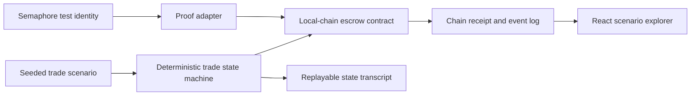

Barter is a substantial commodity-market application prototype. Its strongest next form is a **verifiable trade protocol lab**, not a production exchange claim.

  

    Status
    Experiment
  

  

    Implemented center
    Full-stack workflows and Semaphore integration code
  

  

    Critical boundary
    Escrow and blockchain telemetry are simulated
  

<Warning>
  The public README currently describes blockchain-backed smart contracts and AI-powered matching as implemented features. The public code does not support those claims at that level.
</Warning>

## Implemented in the public repository

- a React and TypeScript client with marketplace, account, contract, KYC, onboarding, and administration surfaces;
- an Express API with session authentication and shared Zod/Drizzle schemas;
- PostgreSQL storage through Drizzle and a migration runner;
- WebSocket notification handling;
- commodity, offer, contract, transaction, notification, and KYC records;
- imports and service code for Semaphore identity, group membership, proof generation, and proof verification;
- demo-oriented UI flows and seeded records.

These pieces establish a broad application shell and a useful protocol-design surface.

## Simulated in the public repository

[`server/services/smart-contract-service.ts`](https://github.com/fortunexbt/barter/blob/main/server/services/smart-contract-service.ts) explicitly describes itself as a simulation. It generates:

- contract addresses;
- transaction hashes;
- block numbers;
- confirmation counts;
- token balances;
- randomized delay and success behavior.

Those values are stored in application records. No deployed contract, chain client, RPC boundary, chain ID, contract source, or transaction receipt is present in the public tree.

The appropriate public description is **escrow workflow simulation**.

## Present but not verified end to end

The Semaphore service calls the package's `generateProof` and `verifyProof` functions. That is more substantial than a random proof-shaped string.

However:

- no automated tests exercise identity creation, group membership, proof generation, and verification together;
- no CI workflow runs a TypeScript or integration gate;
- the current route call and service signature need to be reconciled before claiming the flow builds and runs;
- identity material and persistence require an explicit security model.

The appropriate label is **integration code present; end-to-end proof unverified**.

## Not evidenced

The public tree does not show a model provider, matching algorithm, evaluation, or training artifact that supports “AI-powered matching.” It contains match fields and values, but not evidence of an AI matching system.

The appropriate label is **planned or remove the claim**.

## Target architecture

The target deliberately separates three proofs:

1. a deterministic application state transition;
2. a verified membership or eligibility proof;
3. a real local-chain escrow receipt.

## Promotion gates

- Correct the README and clone path before adding features.
- Add an explicit license file and CI workflow.
- Make the application start from a documented seeded database.
- Test the TypeScript build, authentication boundary, trade state machine, WebSocket path, and proof adapter.
- Replace random transaction telemetry with a clearly named simulation adapter.
- Add a local Anvil or Hardhat contract path only when a real receipt can be inspected.
- Keep identity proof, KYC review, and legal compliance as separate claims.
- Publish a threat model before accepting real identity documents or value.

## Inspect the source

- [Repository](https://github.com/fortunexbt/barter)
- [Smart-contract simulation service](https://github.com/fortunexbt/barter/blob/main/server/services/smart-contract-service.ts)
- [Semaphore service](https://github.com/fortunexbt/barter/blob/main/server/services/zkp-service.ts)
- [Routes and WebSocket surface](https://github.com/fortunexbt/barter/blob/main/server/routes.ts)
- [Shared data schema](https://github.com/fortunexbt/barter/blob/main/shared/schema.ts)

