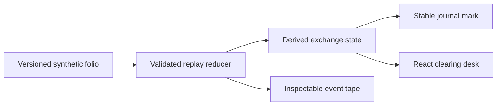

Barter v2.0.0 is a released protocol lab: three synthetic commodity exchanges, one validated state machine, and an event tape that runs without accounts, secrets, a database, or an external service.

<div className="fm-evidence-strip fm-lab-warning">
  <div className="fm-evidence-cell">
    <span className="fm-proof-label">Status</span>
    <span className="fm-proof-value">Released lab · v2.0.0</span>
  </div>
  <div className="fm-evidence-cell">
    <span className="fm-proof-label">Verified center</span>
    <span className="fm-proof-value">Deterministic reducer, three fixtures, four tests, CI</span>
  </div>
  <div className="fm-evidence-cell">
    <span className="fm-proof-label">Critical boundary</span>
    <span className="fm-proof-value">Every party, document, price, and outcome is synthetic</span>
  </div>
</div>

## The released proof

The public `/lab` route presents three fixed exchange folios:

- a direct copper-cathode / green-coffee exchange;
- a durum-wheat / freight-capacity counter-offer;
- a cocoa-bean / machine-bearing inspection hold and cancellation.

Each folio contains a versioned event journal. Forward, backward, reset, and timed replay derive state from that immutable input. A stable journal mark changes with the applied event prefix. Invalid transitions fail loudly, and replay boundaries clamp without mutating the fixtures.



This is a proof of application-state behavior. It is not a proof of market price, title, custody, inspection, identity, payment, or legal enforceability.

## The legacy workspace

The original React/Express marketplace surface remains available for architecture exploration. It now carries a global **legacy prototype** disclosure and uses deterministic in-memory fixtures when `DATABASE_URL` is absent.

The revival also repaired concrete trust-boundary defects:

- registration cannot assign administrator or verified roles;
- password hashes and proof secrets are excluded from responses;
- no hardcoded administrator credential remains;
- unauthenticated WebSocket identity claims are disabled;
- real KYC file intake is removed—only three named synthetic fixture IDs are accepted by UI and API;
- persistent production mode requires an explicit session secret.

The former Semaphore dependency path was removed. The surviving identity experiment is conspicuously labeled a **non-zero-knowledge local challenge fixture**.

## Reproduce it

```bash
git clone https://github.com/fortunexbt/barter.git
cd barter
npm ci
npm run verify
npm run dev
```

Open `http://localhost:5000/lab`. The lab makes no external call and never enters the authenticated legacy workspace.

`npm run verify` runs TypeScript checking, four deterministic replay tests, and the production build. The CI workflow also audits production dependencies; v2.0.0 shipped with zero known production dependency vulnerabilities.

## Simulation ledger

| Surface | Label |
|---|---|
| Scenario values, participants, documents, and inspection records | Simulated fixtures |
| Matching, counter-offer, hold, cancellation, and settlement states | Deterministic application behavior |
| Agreement, escrow, token, and transaction-shaped records in the legacy UI | Simulated; no chain or custody adapter |
| AI-powered matching | Not implemented |
| Real identity verification, commodity transfer, payment, title, and logistics | Not implemented |

<Warning>
  Do not submit identity documents, wallet keys, funds, commercial records, or live counterparties to this lab. It has not been audited for custody, compliance, or production commodity trading.
</Warning>

## Next proof gates

- Persist a signed append-only journal and prove replay from that artifact.
- Introduce an inspection or identity adapter only with synthetic sandbox receipts and a threat model.
- Add a real local-chain contract only when contract source, chain ID, transaction receipt, and failure behavior are inspectable together.
- Keep identity proof, KYC review, legal agreement, custody, and settlement as separate claims.

## Inspect the evidence

- [v2.0.0 release](https://github.com/fortunexbt/barter/releases/tag/v2.0.0)
- [Protocol lab source](https://github.com/fortunexbt/barter/blob/main/client/src/pages/protocol-lab-page.tsx)
- [Replay engine](https://github.com/fortunexbt/barter/blob/main/client/src/features/protocol-lab/demo-engine.ts)
- [Replay tests](https://github.com/fortunexbt/barter/blob/main/client/src/features/protocol-lab/demo-engine.test.ts)
- [CI proof](https://github.com/fortunexbt/barter/actions/workflows/ci.yml)
- [Capability ledger](https://github.com/fortunexbt/barter#capability-ledger)
