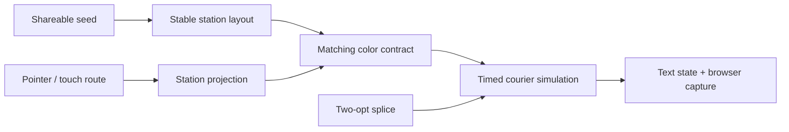

Loop Courier v1.0.0 is a shipped, dependency-free browser game. You draw one closed delivery loop through a seeded city, then spend three graph splices while packages expire and hazards reshape the run.

<div className="fm-evidence-strip">
  <div className="fm-evidence-cell">
    <span className="fm-proof-label">Status</span>
    <span className="fm-proof-value">Shipped · v1.0.0 · GitHub Pages</span>
  </div>
  <div className="fm-evidence-cell">
    <span className="fm-proof-label">Verified center</span>
    <span className="fm-proof-value">Seeded core tests + complete Chromium delivery, splice, modal, and mobile smoke</span>
  </div>
  <div className="fm-evidence-cell">
    <span className="fm-proof-label">Critical boundary</span>
    <span className="fm-proof-value">Synthetic city and local run; no service, account, telemetry, or external media</span>
  </div>
</div>

## The mechanic

Circles are pickups, squares are dropoffs, and color defines a contract. A valid loop must pass through at least one matching pair. Once the courier starts, packages acquire deadlines, jams slow route segments, and tolls consume score.

A splice applies a two-opt graph operation: choose two non-adjacent edges, remove them, and reconnect the two path segments in the other valid order. The player gets only three, turning route editing into a scarce mid-run control rather than a reset button.



## What the launch smoke proves

The public CI smoke uses seed `METRO-7` and asserts a complete path rather than checking only that the page loads:

- closes a route through the blue pickup and dropoff;
- starts the run and completes one delivery for 33 points;
- freezes the round clock during pause;
- consumes one valid splice while preserving the contract;
- completes tutorial, fullscreen, round-over, replay, new-seed, copy-link, and reset actions;
- closes a touch route at a 390 × 844 viewport with 46-pixel minimum visible controls.

The first public run found an asynchronous clipboard-proof race. The test now waits for the copy result, and the repaired main-branch CI is green. That failure is useful evidence: the workflow is exercising behavior, not rubber-stamping a bundle.

## Reproduce it

Play the [hosted release](https://fortunexbt.github.io/loop-courier/), or run it locally:

```bash
git clone https://github.com/fortunexbt/loop-courier.git
cd loop-courier
npm ci
npm run verify
npm run dev
```

In another terminal, after installing the Playwright browser:

```bash
npx playwright install chromium
npm run test:browser
```

The app also exposes `window.render_game_to_text()` and `window.advanceTime(ms)` for lower-level deterministic inspection.

## Boundaries and next gates

All city data and run outcomes are generated locally. A shared seed reproduces layout, not another player's complete input history.

Non-spatial controls are keyboard accessible, but drawing or splicing the canvas remains a pointer/touch interaction. A keyboard-only route-construction model is the most important accessibility gate. Cross-browser E2E and longer hazard campaigns are also still open.

## Inspect the evidence

- [Play Loop Courier](https://fortunexbt.github.io/loop-courier/)
- [v1.0.0 release](https://github.com/fortunexbt/loop-courier/releases/tag/v1.0.0)
- [Deterministic core](https://github.com/fortunexbt/loop-courier/blob/main/game-core.js)
- [Core tests](https://github.com/fortunexbt/loop-courier/blob/main/tests/game-core.test.js)
- [Complete browser smoke](https://github.com/fortunexbt/loop-courier/blob/main/scripts/browser-smoke.mjs)
- [Public CI](https://github.com/fortunexbt/loop-courier/actions/workflows/ci.yml)
