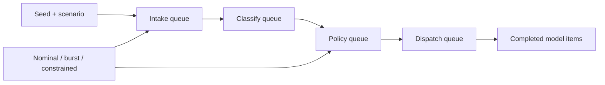

Queueglass v1.0.0 is a local discrete-event laboratory for queue pressure, stage capacity, retry decisions, and recovery. Every displayed value comes from a seed and a toy scenario; no production telemetry, account, integration, financial estimate, or observed result enters the model.

<div className="fm-evidence-strip fm-lab-warning">
  <div className="fm-evidence-cell">
    <span className="fm-proof-label">Status</span>
    <span className="fm-proof-value">Released simulator · v1.0.0</span>
  </div>
  <div className="fm-evidence-cell">
    <span className="fm-proof-label">Verified center</span>
    <span className="fm-proof-value">Six replay/invariant tests, clean-clone build, Chromium desktop/mobile smoke</span>
  </div>
  <div className="fm-evidence-cell">
    <span className="fm-proof-label">Critical boundary</span>
    <span className="fm-proof-value">SIMULATED · LOCAL · SEEDED · REPLAYABLE; arbitrary model units, not a benchmark</span>
  </div>
</div>

## The model



Three scenarios change only declared model parameters:

- **Nominal flow** uses balanced synthetic arrival pressure and stage capacity.
- **Burst pressure** adds a repeatable, tick-bounded surge.
- **Policy constrained** reduces the policy stage and introduces seeded retry decisions.

The primary invariant is visible in the UI and tests:

```text
synthetic arrivals = completed items + items still in the model
```

Capacities and compute are arbitrary units. Sojourn is measured in simulation ticks. The output is not throughput, latency, uptime, accuracy, cost, savings, staffing, service level, or architecture evidence.

## Reproduce it

```bash
git clone https://github.com/fortunexbt/queueglass.git
cd queueglass
npm ci
npm run verify
npm run dev
```

Open `http://localhost:3000/?seed=QUEUEGLASS-7&scenario=burst`. The seed and scenario remain in the replay URL.

The complete browser smoke exercises scenario switching, one- and ten-tick steps, reset, auto-run/pause, URL copy, fullscreen/Escape, and a 390-pixel mobile layout. It reports zero external requests and zero browser errors.

`window.render_game_to_text()` exposes the provenance statement, seed, scenario, tick, metrics, stages, current synthetic work, and recent decisions. `window.advanceTime(ms)` advances fixed 600-millisecond model ticks without putting wall-clock values into state.

## Why the reframing matters

The recovered interface used random timers and hard-coded finance, staffing, performance, message-volume, integration, and customer-like claims under live-telemetry language. Those components and data generators were deleted.

The public project uses a neutral identity and a clean-room model. Claim and secret scans fail the release if the removed brand, customer/integration language, or known faux-live metrics return.

## Remaining proof gates

- The model is small, single-process, and pedagogical rather than calibrated.
- Browser E2E currently targets Chromium.
- Scenario parameters need a cited external model before they can represent a real queue.
- Results must never be presented as evidence about a company, team, product, deployment, or operating environment.

## Inspect the evidence

- [v1.0.0 release](https://github.com/fortunexbt/queueglass/releases/tag/v1.0.0)
- [Simulation core](https://github.com/fortunexbt/queueglass/blob/main/src/lib/simulation.js)
- [Replay and conservation tests](https://github.com/fortunexbt/queueglass/blob/main/tests/simulation.test.js)
- [Browser smoke](https://github.com/fortunexbt/queueglass/blob/main/scripts/browser-smoke.mjs)
- [Truth-boundary scan](https://github.com/fortunexbt/queueglass/blob/main/scripts/claim-scan.mjs)
- [Public CI](https://github.com/fortunexbt/queueglass/actions/workflows/ci.yml)
