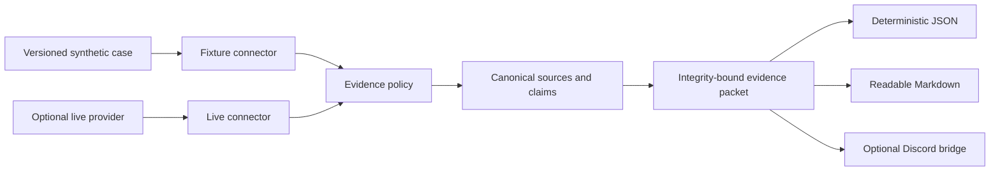

SecurePath v0.2.0 is an offline-first evidence lab. Its default command needs no Discord token, provider key, database, third-party package, or network request.

<div className="fm-evidence-strip fm-lab-warning">
  <div className="fm-evidence-cell">
    <span className="fm-proof-label">Status</span>
    <span className="fm-proof-value">Released lab · v0.2.0</span>
  </div>
  <div className="fm-evidence-cell">
    <span className="fm-proof-label">Verified center</span>
    <span className="fm-proof-value">Deterministic replay, 35 tests, Python 3.11–3.13</span>
  </div>
  <div className="fm-evidence-cell">
    <span className="fm-proof-label">Critical boundary</span>
    <span className="fm-proof-value">Integrity detects change; it does not establish source truth</span>
  </div>
</div>

## The offline proof

```bash
git clone https://github.com/fortunexbt/securepath.git
cd securepath
python -m securepath replay --format json --verify
```

The command loads a labeled synthetic validator-operations case, applies the evidence policy, canonicalizes and deduplicates its sources, maps claims to stable source IDs, and computes an integrity identity over the complete public evidence payload.

The packaged case currently produces packet `sp_b176b4aa1c386d35`. Repeating the command produces the same JSON, Markdown, packet ID, and SHA-256 digest.



## What the policy checks

- claims reference known source IDs;
- fixture cases cannot smuggle live, file, or executable URIs;
- live citations require HTTPS and reject embedded credentials or secret-shaped query fields;
- timestamps include a timezone;
- unsourced answers cannot attach source-shaped data;
- metadata, questions, messages, and source material remain size-bounded;
- duplicate canonical URLs collapse and claim references remap;
- Discord mentions are neutralized before delivery.

Changing the answer, sources, claims, metadata, or capture details breaks verification.

## Explicit live adapters

Live configuration is loaded only by an explicit live command. Selecting OpenAI requires only `OPENAI_API_KEY`; selecting Perplexity requires only `PERPLEXITY_API_KEY`. Configuration summaries expose provider, model, host, timeout, and rate-limit settings—never secret values.

| Adapter | Evidence state | Boundary |
|---|---|---|
| Perplexity | `provider-cited` when the response contains supported citation shapes | Citations are preserved, not independently checked |
| OpenAI chat completion | `unsourced` | Normal completion output supplies no citation chain this lab can preserve |
| Discord `!ask` | Same packet as the selected provider | Mention-safe and process-rate-limited; not multi-instance abuse control |

Live HTTP errors expose status or exception type rather than provider response bodies. Redirects are blocked so a configured endpoint cannot silently carry a request to another host.

## What was intentionally removed

The legacy application mixed Discord events, chart analysis, conversation memory, scheduled summaries, owner commands, PostgreSQL telemetry, provider I/O, and performance language inside a 2,088-line module. Those surfaces had no maintained offline proof and are not part of v0.2.0.

This is a scope reduction and a trust improvement. The useful center—provider results, citations, policy, provenance, and presentation—is now independently testable.

## What the hash cannot prove

<Warning>
  A valid packet proves only that its recorded evidence payload has not changed. It does not prove that a cited page is correct, that a provider represented it faithfully, that the page still contains the same content, or that a generated conclusion is safe to act on.
</Warning>

SecurePath is educational research infrastructure, not financial, legal, security, or investment advice.

## Next proof gates

- Archive source content or content digests when licensing and privacy permit.
- Add a versioned live evaluation corpus with expected domains and claim-support scoring.
- Record provider, model, endpoint policy, latency, cost, and citation outcomes without logging secrets or question bodies.
- Replace the process-local Discord limiter with shared abuse and cost controls before multi-instance use.
- Exercise provider and Discord paths in a credentialed sandbox with recorded, redacted receipts.

## Inspect the evidence

- [v0.2.0 release](https://github.com/fortunexbt/securepath/releases/tag/v0.2.0)
- [Evidence models](https://github.com/fortunexbt/securepath/blob/main/securepath/models.py)
- [Policy boundary](https://github.com/fortunexbt/securepath/blob/main/securepath/policy.py)
- [Provenance identity](https://github.com/fortunexbt/securepath/blob/main/securepath/provenance.py)
- [Offline fixture](https://github.com/fortunexbt/securepath/blob/main/securepath/fixtures/validator_controls.json)
- [35-test suite](https://github.com/fortunexbt/securepath/tree/main/tests)
- [CI proof](https://github.com/fortunexbt/securepath/actions/workflows/test.yml)
