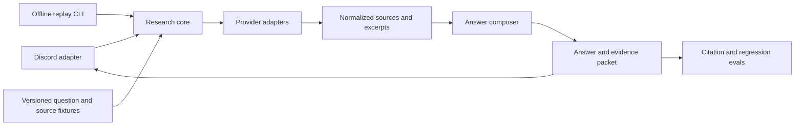

SecurePath is a Discord-native crypto research agent with real provider, chart, telemetry, and operations code. Its credible next step is an evidence-replay workbench with Discord as one adapter.

  

    Status
    Experiment
  

  

    Implemented center
    Discord, provider calls, citations, charts, telemetry
  

  

    Critical gap
    No offline replay, automated tests, or research-quality eval
  

## Implemented in the public repository

- Discord commands, direct-message handling, presence, long responses, and embeds;
- Perplexity and OpenAI client paths;
- source extraction and citation formatting on the Perplexity response path;
- image and chart analysis commands with model fallback behavior;
- conversation context handling and multi-channel summaries;
- rate and daily-use controls;
- token and cost telemetry;
- PostgreSQL-oriented usage and query logging through `asyncpg`;
- a small health endpoint and process lifecycle handling.

This is meaningful integration work. It is concentrated in a large application module, which makes isolated verification difficult.

## Configuration boundary

The current configuration validates credentials at import time. `DISCORD_TOKEN` and `OWNER_ID` are required. `PERPLEXITY_API_KEY` is inserted into the required configuration set before the provider branch, so the OpenAI-only path still fails without a Perplexity key.

That is an implementation defect, not an operator prerequisite. Provider-specific validation should occur only when that provider is selected.

## Claims without an evaluation surface

The README describes high-performance, advanced, and “quant-level” analysis. The repository has no fixture corpus, expected citation set, accuracy rubric, regression evaluation, or benchmark supporting those quality claims.

The appropriate description is **crypto research agent experiment with source-aware and chart-analysis paths**.

<Warning>
  SecurePath provides generated research, not financial advice. A citation proves that a source was attached to an answer; it does not prove that the source supports every conclusion.
</Warning>

## Target architecture

This shape moves provider and research behavior out of the Discord event loop. The same fixture can then run through a fake provider in CI and a live provider in an explicitly networked evaluation.

## Promotion gates

- Split Discord, provider, research, persistence, and presentation concerns into modules.
- Add `.env.example` without secrets and validate provider credentials lazily.
- Add an offline fixture that starts without Discord or external keys.
- Test rate limits, context trimming, citation normalization, provider errors, and configuration branches.
- Define a small evaluation corpus with expected source domains and claim support.
- Record provider/model/version and source URLs in an evidence packet.
- Add CI, a real license file, and a versioned lab release.
- Replace performance adjectives with measured latency, cost, and eval results.

## Inspect the source

- [Repository](https://github.com/fortunexbt/securepath)
- [Application module](https://github.com/fortunexbt/securepath/blob/main/main.py)
- [Configuration](https://github.com/fortunexbt/securepath/blob/main/config.py)
- [Database manager](https://github.com/fortunexbt/securepath/blob/main/database.py)
- [Dependency list](https://github.com/fortunexbt/securepath/blob/main/requirements.txt)
