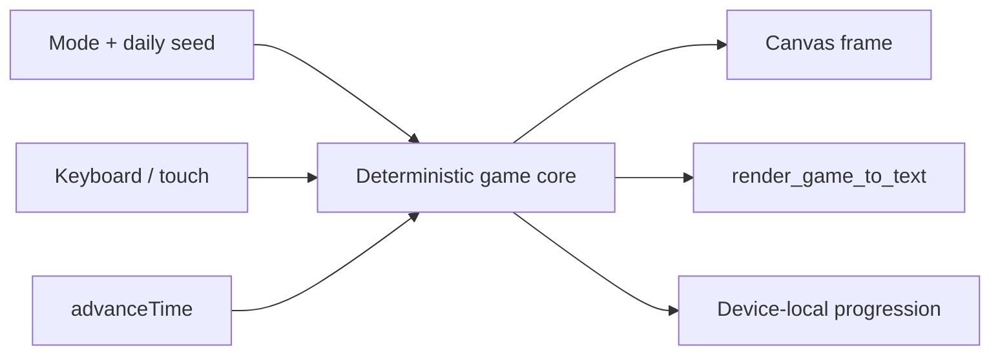

Solar Drift v1.0.0 is a shipped browser game. It turns a recovered Snake prototype into a warm retro-futurist roguelite with daily seeds, modular builds, local progression, and a runtime-synthesized score.

<div className="fm-evidence-strip">
  <div className="fm-evidence-cell">
    <span className="fm-proof-label">Status</span>
    <span className="fm-proof-value">Shipped · v1.0.0 · GitHub Pages</span>
  </div>
  <div className="fm-evidence-cell">
    <span className="fm-proof-label">Verified center</span>
    <span className="fm-proof-value">13 tests, strict TypeScript, production build, browser control flows</span>
  </div>
  <div className="fm-evidence-cell">
    <span className="fm-proof-label">Critical boundary</span>
    <span className="fm-proof-value">Device-local progress; no account, backend, multiplayer, or runtime network dependency</span>
  </div>
</div>

## What shipped

- three run profiles with different pacing and rules;
- 21 stackable run modules and seven permanent workshop upgrades;
- date-seeded daily targets and a score-sorted local leaderboard;
- keyboard, swipe, and coarse-pointer controls;
- procedural WebAudio music and effects with no bundled recording;
- first-run guidance, live status announcements, pause/resume, and responsive HUD layouts.

The game stores progression in browser `localStorage`. Clearing site data resets that device. “Leaderboard” means local ordering, not a remote competitive service.

## The inspectable run boundary



`window.render_game_to_text()` reports the current phase, grid coordinates, player body, direction, resources, collectibles, hazards, and module choices. `window.advanceTime(ms)` advances the simulation in bounded fixed steps. These hooks let a browser test compare machine-readable state with the visible canvas without changing normal play.

The release browser pass exercised movement, boost, pause, resume, restart, and quit. A discovered focus race was fixed by making the resume handoff synchronous; the same change improves keyboard and assistive-technology predictability.

## Reproduce it

Play the [hosted release](https://fortunexbt.github.io/solar-drift/), or run the exact public source:

```bash
git clone https://github.com/fortunexbt/solar-drift.git
cd solar-drift
npm ci
npm run check
npm run dev
```

`npm run check` performs strict TypeScript checking, runs 13 deterministic tests, and produces the Vite bundle. The Pages workflow repeats the check before deployment.

## Provenance and privacy

Four malformed, provenance-free audio blobs were removed during recovery. Oscillators, filtered noise, envelopes, delay, and panning now generate the score and effects at runtime. Google Fonts were also removed, leaving a zero-network play path after the static assets load.

The application does not send gameplay state, scores, identifiers, or telemetry to a service. That boundary is useful for privacy and for reproducibility; it is not cloud persistence.

## Remaining proof gates

- Cover every module choice and hazard type in a longer automated campaign.
- Add cross-browser E2E runs beyond Chromium-derived launch validation.
- Define an export/import format before claiming portable progression.
- Keep any future network leaderboard separate from the local deterministic core and threat-model abuse first.

## Inspect the evidence

- [Play Solar Drift](https://fortunexbt.github.io/solar-drift/)
- [v1.0.0 release](https://github.com/fortunexbt/solar-drift/releases/tag/v1.0.0)
- [Game runtime](https://github.com/fortunexbt/solar-drift/blob/main/src/game.ts)
- [Deterministic core tests](https://github.com/fortunexbt/solar-drift/blob/main/src/core.test.ts)
- [Pages workflow](https://github.com/fortunexbt/solar-drift/actions/workflows/pages.yml)
