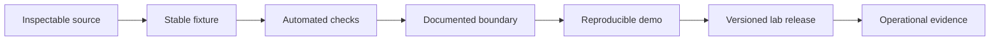

Labs contain real code and unresolved operating assumptions. They are documented here because an honest experiment is more useful than a polished ambiguity.

  

    Reviewed
    21 July 2026 · public default branches
  

  

    Promotion rule
    Reproducible demo, tests, explicit boundary, versioned release
  

  

    Editorial rule
    Code wins when README and implementation disagree
  

## Current ledger

| Lab | Implemented | Simulated or unverified | Next proof gate |
|---|---|---|---|
| [Barter](/labs/barter) | React/Express application, PostgreSQL adapter, session flows, WebSocket notifications, Semaphore proof code | Blockchain receipts and balances are generated; AI matching is not evidenced; proof flow lacks end-to-end verification | Deterministic scenario, CI, tests, real local-chain receipt, verified proof flow |
| [SecurePath](/labs/securepath) | Discord integration, OpenAI/Perplexity clients, citations handling, chart command, usage telemetry, database manager | “Quant-level” quality is not evaluated; no offline fixture or test suite; provider configuration has a hard requirement bug | Modular core, fixture replay, citation evals, provider-specific configuration tests |

## Why the labels matter

Barter contains a service named `SmartContractService`. The implementation says that it simulates blockchain behavior and generates transaction-shaped values with randomness. The correct label is **simulated**, regardless of the class name.

SecurePath retrieves citations on one provider path and contains substantial Discord operations code. It does not have an evaluation harness proving research accuracy. The correct label is **experiment**, not “verified intelligence.”

## Promotion sequence

Projects can publish a lab release before production readiness. The release must preserve the lab label and make the unsupported envelope easy to find.

<Note>
  A lab page should be updated in the same change that crosses one of these boundaries. Dated status prevents old caution from surviving after a fix—or old ambition from surviving after a pivot.
</Note>

