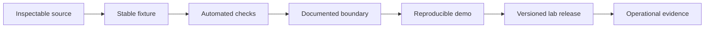

Experiments can earn a release without pretending to be production systems. Five revived projects now ship reproducible proofs; their external-world and operational claims remain deliberately bounded.

  

    Reviewed
    22 July 2026 · public default branches
  

  

    Promotion earned
    Fixture, tests, explicit boundary, CI, versioned release
  

  

    Still required
    Operational evidence for every live integration claim
  

## Current ledger

| Lab | Verified now | Simulated or unverified | Next proof gate |
|---|---|---|---|
| [Barter](/labs/barter) | Three deterministic exchange fixtures, validated reducer, immutable event replay, no-secret/no-database mode, four tests, CI, v2.0.0 release | Parties, prices, documents, identity, inspection, escrow, settlement, and every represented exchange outcome | Signed external evidence, a real integration receipt, and a threat model before handling identity or value |
| [SecurePath](/labs/securepath) | Dependency-free evidence replay, policy-checked citations, canonical provenance hash, 35 tests across Python 3.11–3.13, CI, v0.2.0 release | Provider citation truth, live provider/Discord operation, multi-instance rate control, and source-page preservation | Recorded live evaluations with archived evidence, claim-support scoring, and deployment-level abuse/cost controls |
| [Solar Drift](/labs/solar-drift) | v1.0.0, live Pages game, 13 tests, deterministic inspection hooks, browser-verified control flows, zero-network runtime | Cloud saves, remote leaderboard, multiplayer, complete all-module/all-hazard E2E | Cross-browser campaign coverage and a defined portable progression format |
| [Loop Courier](/labs/loop-courier) | v1.0.0, live Pages game, seeded core tests, real delivery/splice E2E, 390 px touch proof | Shared run histories, service-backed scores, keyboard-only canvas route construction | Keyboard route model, cross-browser E2E, longer hazard campaigns |
| [Switchyard](/labs/switchyard) | v1.0.0, deterministic fixture route, 13 tests, real stop invalidation, body-free receipt test, dependency and secret audits | Authentication, network providers, live writes, distributed stop state, signed audit storage | Authenticated sandbox adapter with durable shared stop state and signed receipts |

## What changed

Barter no longer presents generated blockchain telemetry or an untested proof package as a live capability. The public center is an air-gapped protocol study. Its legacy application remains available behind conspicuous simulation labels, and real identity-document intake is removed.

SecurePath no longer requires Discord or provider credentials to import or run. Its default path constructs the same integrity-bound evidence packet from a packaged synthetic case. Live providers and Discord are lazy adapters over that core.

## Why these are still labs

A deterministic settlement state is not legal settlement. A provider-supplied citation is not independent source verification. The releases prove software behavior inside a controlled envelope; they do not prove the external institutions, data, or counterparties represented by the interface.

All five projects have reached **Release** for a specific bounded surface. None inherits an **Operate** claim for an external system merely because its local proof is green.

<Note>
  A lab page should change in the same pull request that crosses one of these boundaries. Dated status prevents old caution from surviving after a fix—or old ambition from surviving after a pivot.
</Note>
