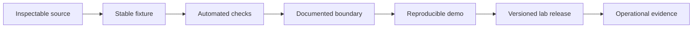

Experiments can earn a release without pretending to be production systems. Seven revived projects earned reproducible releases; six remain promoted while SecurePath completes a historical credential-remediation gate.

  

    Reviewed
    22 July 2026 · public default branches
  

  

    Promotion earned
    Fixture, tests, explicit boundary, CI, versioned release
  

  

    Still required
    Operational evidence for every live integration claim
  

## Current ledger

| Lab | Verified now | Simulated or unverified | Next proof gate |
|---|---|---|---|
| [Barter](/labs/barter) | Three deterministic exchange fixtures, validated reducer, immutable event replay, no-secret/no-database mode, four tests, CI, v2.0.0 release | Parties, prices, documents, identity, inspection, escrow, settlement, and every represented exchange outcome | Signed external evidence, a real integration receipt, and a threat model before handling identity or value |
| [SecurePath · security hold](/labs/securepath) | Current dependency-free replay, policy checks, provenance hash, and 35-test suite remain verified | Public promotion and clone instructions are paused; live provider/Discord behavior remains unverified | Confirm credential revocation, purge the historical path and cached objects, pass a fresh scan, then cut a replacement release |
| [Solar Drift](/labs/solar-drift) | v1.0.0, live Pages game, 13 tests, deterministic inspection hooks, browser-verified control flows, zero-network runtime | Cloud saves, remote leaderboard, multiplayer, complete all-module/all-hazard E2E | Cross-browser campaign coverage and a defined portable progression format |
| [Loop Courier](/labs/loop-courier) | v1.0.0, live Pages game, seeded core tests, real delivery/splice E2E, 390 px touch proof | Shared run histories, service-backed scores, keyboard-only canvas route construction | Keyboard route model, cross-browser E2E, longer hazard campaigns |
| [Switchyard](/labs/switchyard) | v1.0.0, deterministic fixture route, 13 tests, real stop invalidation, body-free receipt test, dependency and secret audits | Authentication, network providers, live writes, distributed stop state, signed audit storage | Authenticated sandbox adapter with durable shared stop state and signed receipts |
| [Ambient Relay](/labs/ambient-relay) | v1.0.0, credential-free synthetic replay, 14 tests, deterministic terminal artifact, no outbound work, zero audit findings | Live Discord account behavior, durable receipts, shared cooldown, emergency stop control | Credentialed sandbox observation, recorded redacted receipts, distributed control state before any unattended send mode |
| [Queueglass](/labs/queueglass) | v1.0.0, seeded discrete-event core, six invariants, clean-clone build, desktop/mobile browser smoke, zero external requests | Production telemetry, calibrated parameters, benchmark or architecture claims, non-Chromium E2E | Cited model calibration and cross-browser evidence before representing any real queue |

## What changed

Barter no longer presents generated blockchain telemetry or an untested proof package as a live capability. The public center is an air-gapped protocol study. Its legacy application remains available behind conspicuous simulation labels, and real identity-document intake is removed.

SecurePath no longer requires Discord or provider credentials to import or run, and its current tree excludes the affected historical file. The implementation proof remains useful, but promotion and reproduction links stay paused until provider-side revocation and repository-history remediation are verified.

## Why these are still labs

A deterministic settlement state is not legal settlement. A provider-supplied citation is not independent source verification. The releases prove software behavior inside a controlled envelope; they do not prove the external institutions, data, or counterparties represented by the interface.

All seven projects reached **Release** for a specific bounded surface; six remain promoted. SecurePath demonstrates that release status is reversible when a security gate changes. None inherits an **Operate** claim for an external system merely because its local proof is green.

<Note>
  A lab page should change in the same pull request that crosses one of these boundaries. Dated status prevents old caution from surviving after a fix—or old ambition from surviving after a pivot.
</Note>
