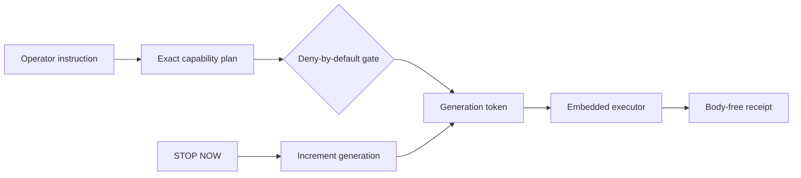

Switchyard v1.0.0 is a released offline proof. It routes one deterministic incident fixture through a plan, deny-by-default policy gate, generation-token stop boundary, synthetic executor, and metadata-only receipt ledger.

<div className="fm-evidence-strip fm-lab-warning">
  <div className="fm-evidence-cell">
    <span className="fm-proof-label">Status</span>
    <span className="fm-proof-value">Released experiment · v1.0.0 · loopback only</span>
  </div>
  <div className="fm-evidence-cell">
    <span className="fm-proof-label">Verified center</span>
    <span className="fm-proof-value">13 backend tests, real in-flight stop invalidation, UI build, audits, integration smoke</span>
  </div>
  <div className="fm-evidence-cell">
    <span className="fm-proof-label">Critical boundary</span>
    <span className="fm-proof-value">No authentication, network provider, voice surface, or live write integration</span>
  </div>
</div>

## The route



The policy admits only the fixture-read capability used by the packaged recovery drill. There is no generic shell, file, repository, email, messaging, browsing, or provider adapter. External writes are absent rather than hidden behind a disabled button.

Every execution checks its issued generation token before and after the synthetic work. `STOP NOW` increments the generation and latches the boundary. An in-flight operation holding an older token cannot commit a successful receipt. Reset is separate, explicit, and audited.

## Receipts, not transcripts

The SQLite ledger stores status, capability, policy code, stop generation, timestamps, and request/result fingerprints. It does not store the operator command or result body. A byte-level test checks that sensitive fixture strings never enter the database file.

That reduction matters, but it is not tamper evidence. The local SQLite file is neither signed nor encrypted, and a hash fingerprint does not prove that the synthetic source represents the external world.

## Reproduce it

```bash
git clone https://github.com/fortunexbt/switchyard.git
cd switchyard
python -m venv .venv
.venv/bin/python -m pip install -r backend/requirements-dev.txt
cd frontend && npm ci && cd ..
./scripts/check.sh
./scripts/dev.sh
```

Open `http://127.0.0.1:5173`. The default server binds to loopback, CORS uses an exact non-credentialed loopback allowlist, and the demo needs no `.env`, token, account, or external request.

The public verification covers 13 backend tests, Python dependency audit, frontend typecheck/build, npm audit, secret scan, and a loopback flow that completes and receipts an action, audits stop, and returns HTTP 423 while stopped.

## What was removed

The recovered prototype implied live search, voice, provider, and action capabilities without a maintained proof path. Those surfaces, raw-body audit logging, wildcard credentialed CORS, exception leakage, and bypass routes are not part of Switchyard.

The result is narrower and more useful: the policy, stop, and receipt boundaries can be inspected without believing an integration claim.

## Before any network deployment

<Warning>
  Switchyard has no authentication. Do not expose it beyond loopback. The stop controller is process-local, cancellation is cooperative, and receipts are unsigned local metadata.
</Warning>

Network operation would require authentication and authorization, shared durable stop state, adapter-specific policy and sandbox receipts, request/body threat modeling, encrypted or signed audit storage, rate and cost controls, and deployment-level testing.

## Inspect the evidence

- [v1.0.0 release](https://github.com/fortunexbt/switchyard/releases/tag/v1.0.0)
- [Execution boundary](https://github.com/fortunexbt/switchyard/blob/main/backend/app/execution.py)
- [Policy gate](https://github.com/fortunexbt/switchyard/blob/main/backend/app/policy.py)
- [Stop controller](https://github.com/fortunexbt/switchyard/blob/main/backend/app/stop.py)
- [Security envelope](https://github.com/fortunexbt/switchyard/blob/main/SECURITY.md)
- [Public CI](https://github.com/fortunexbt/switchyard/actions/workflows/ci.yml)
