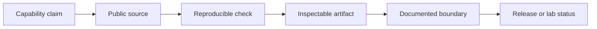

The Field Manual is an evidence map, not a second copy of each README. Use it to understand why a system is shaped the way it is and where to inspect the proof.

## Pick your question

<Columns cols={2}>
  <Card title="How is it built?" icon="waypoints" href="/architecture/mutx">
    Start with an architecture tour. Each tour identifies surfaces, boundaries,
    state, and checks.
  </Card>
  <Card title="Can I reproduce it?" icon="play" href="/recipes/index">
    Run a demo recipe with a documented provider, sample dataset, or deterministic
    seed.
  </Card>
  <Card title="What counts as proof?" icon="badge-check" href="/proof/build-and-release">
    Read the build and release discipline before evaluating a capability claim.
  </Card>
  <Card title="What is still a lab?" icon="flask-conical" href="/labs/status">
    See the implemented-versus-simulated ledger for released labs and bounded experiments.
  </Card>
</Columns>

## The evidence chain

A strong claim should lead you through that chain without a leap of faith. Some systems have all five links. Labs may stop at source or check. The manual says where.

## Status language

<AccordionGroup>
  <Accordion title="Shipped" icon="rocket">
    A release, package, download, hosted surface, or documented public use path exists. The label attaches to a specific surface, not automatically to the entire project.
  </Accordion>
  <Accordion title="Verified" icon="shield-check">
    A reader can run a test, repeat a seeded output, inspect source rows, or examine a release artifact. The verification method appears beside the claim.
  </Accordion>
  <Accordion title="Experiment" icon="flask-conical">
    The code is real. Its security, persistence, scale, compatibility, or operating assumptions remain deliberately narrow.
  </Accordion>
  <Accordion title="Simulated" icon="test-tube-diagonal">
    The software generates behavior that resembles an external system without connecting to it. Random transaction hashes are simulation, not a blockchain integration.
  </Accordion>
  <Accordion title="Planned" icon="route">
    The idea belongs to a future state. It should never appear as a present-tense feature.
  </Accordion>
</AccordionGroup>

## Primary sources

The tours use the following public repositories as their primary evidence:

- [MUTX](https://github.com/mutx-dev/mutx-dev)
- [Tablebeam](https://github.com/fortunexbt/tablebeam)
- [Terminal Starfield](https://github.com/fortunexbt/terminal-starfield)
- [ckitty](https://github.com/fortunexbt/ckitty)
- [Barter](https://github.com/fortunexbt/barter)
- [SecurePath](https://github.com/fortunexbt/securepath)
- [Solar Drift](https://github.com/fortunexbt/solar-drift)
- [Loop Courier](https://github.com/fortunexbt/loop-courier)
- [Switchyard](https://github.com/fortunexbt/switchyard)

<Warning>
  The recipes demonstrate software; they do not replace security review, financial judgment, or the current product documentation. Never paste production credentials into a showcase environment.
</Warning>

## Next

Begin with [the design principles](/principles/index), or go directly to the [MUTX architecture tour](/architecture/mutx).
